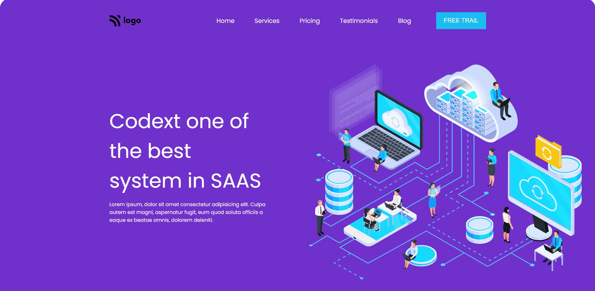

# Rode_clone
>  This is a SAAS landing page UI
> Live demo [_here_](https://js-full-stack.vercel.app/)

## Table of Contents
* [General Info](#general-information)
* [Technologies Used](#technologies-used)
* [Screenshots](#screenshots)
* [Project Status](#project-status)
* [Acknowledgements](#acknowledgements)
* [Contact](#contact)
<!-- * [License](#license) -->

## General Information
- This is Basically a SAAS landing page UI built using  html and css
- This is a responsive website 
- It took me around 3 hours to build this UI

## Technologies Used
- Html
- Css

## Screenshots

## Project Status
Project is: _completed_ 

## Acknowledgements
- This project is assignment from full_stack_js Boot Camp  by  Ineuron [INeuron](https://ineuron.ai/) 

## Contact
[Kodanda rama reddy satti](https://www.instagram.com/kodandareddy550/) - feel free to contact me!

